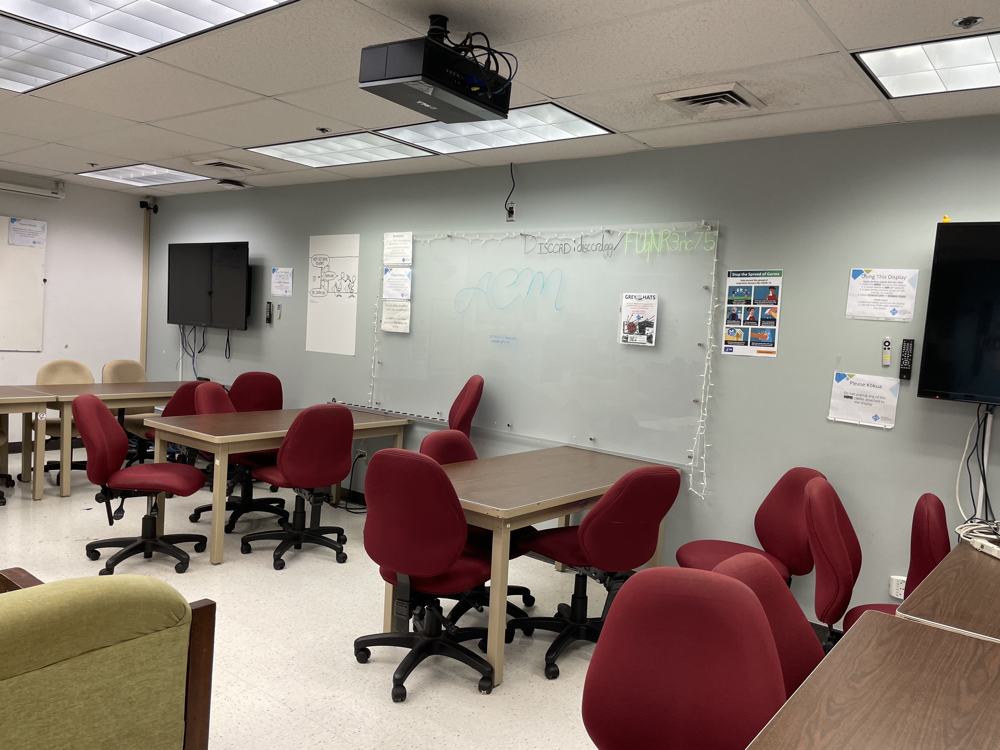
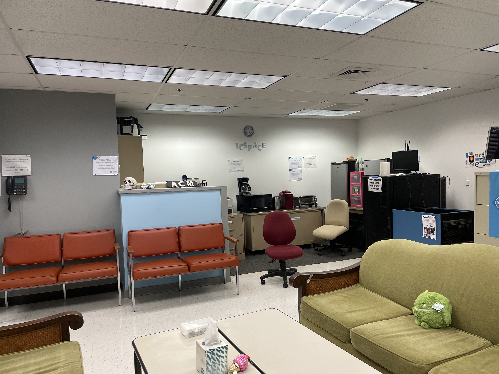
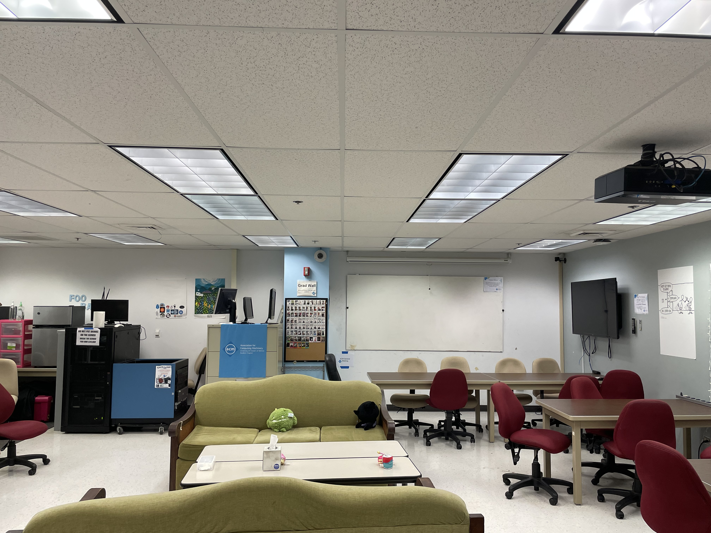
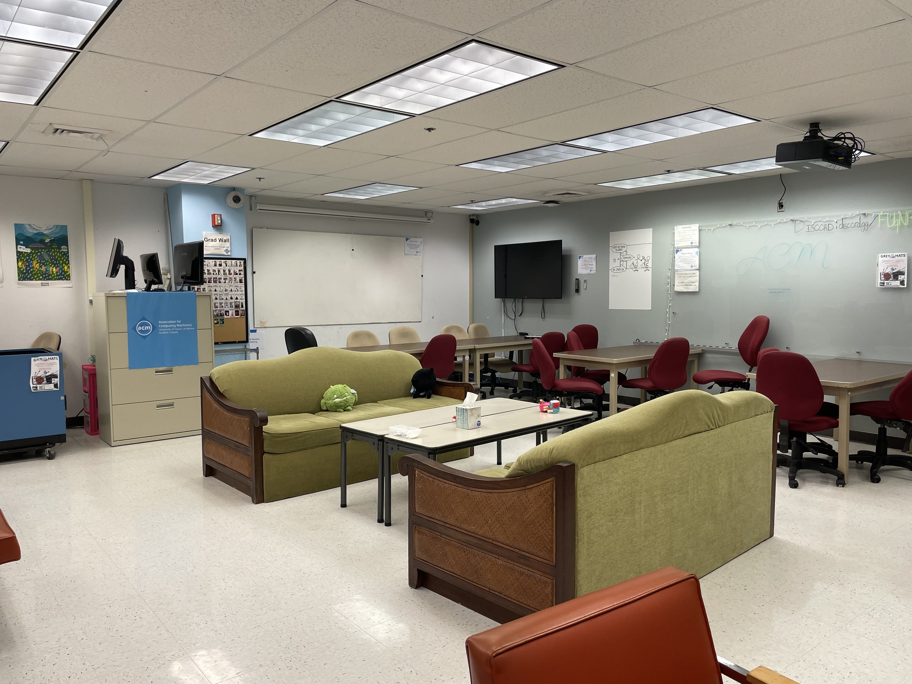

# What is the ICSpace?

POST 318B (ICSpace), is an interactive classroom intended for the use of the ICS Community, which is defined as: ICS undergraduate majors, ICS graduate students, ICS faculty, and ICS staff.  Guests are welcome as long as they are accompanied by an ICS Community member.

<a href="http://www.ics.hawaii.edu/community/post-318b/" target="_blank">Read more on the ICS Department's goals for ICSpace here!</a>

Anyone is welcome to use this space, as long as the following rules are followed:

1. <strong>Respect others who are using the space for work.</strong>
Keep the room in a quiet and reasonable volume.

2. <strong>Keep the room clean and tidy</strong>
The ICSpace is not visited by the school custodians. If you have garbage you'd like to throw out, there is a convenient garbage/recycling can located outside of the room.

	
 
	  

	    
	  	
	  

	  

	    
	  	
	  
 
	

	<link href="//cdn.rawgit.com/noelboss/featherlight/1.7.13/release/featherlight.min.css" type="text/css" rel="stylesheet" />
	
	
	

 

