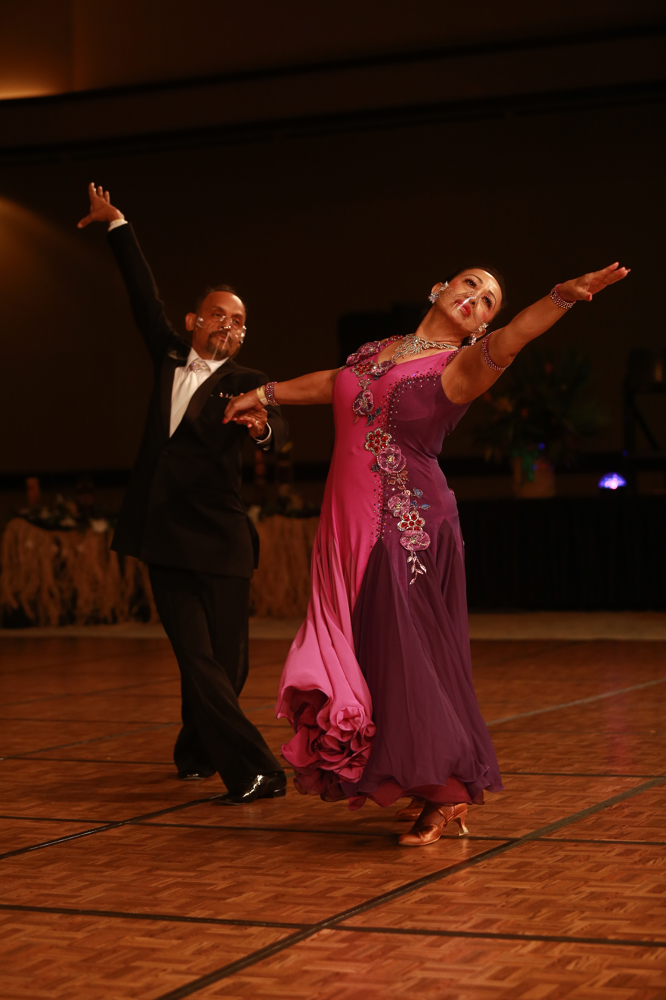

  <a href="#about" class="links nav-col"><h3 class="nav-text">About</h3></a>
  <a href="#howtojoin" class="links nav-col"><h3 class="nav-text">How to Join</h3></a>
  <a href="#" class="links nav-col"><h3 class="nav-text">BDCUHM</h3></a>
  <a href="#" class="links nav-col"><h3 class="nav-text">News</h3></a>
  <a href="#resources" class="links nav-col"><h3 class="nav-text">Resources</h3></a>

  
{% include carousel.html height="50" unit="%" duration="7" number="4" %}

 

  <figure class="bdc-logo-figure">
    
  </figure>

  

    <h3 class="blue-text scroll-text" id="section-header">What is Ballroom Dance Club?</h3>

    
<b>Ballroom dancing</b> is a fun and engaging physical activity that offers stress relief and opportunities to build friendships with other members. It can help improve your posture, boost your confidence, and even enhance your resume. Interestingly, many of the top Adult Amateur ballroom dancers in the US are <b>Computer Science</b> or <b>Engineering</b> majors and graduates — you might even have one of them interview you for your next job!

  

  

    <h3 id="section-header" style="color: white;">What We Do</h3>

    

      Each semester, we learn the basics of various ballroom dances, including the 
      Waltz, 
      Cha-cha, 
      Tango, 
      Rumba, 
      Foxtrot, and 
      Swing.
    
        

      Beyond our classes, we have opportunities to perform for the ballroom dance community in Hawaii. We also participate in the ballroom dance competitions held twice a year in the state, and in 2024, we had the chance to compete nationally at the DanceSport Championships.
    
        
    
      Typically, we have at least one 
      performance and one 
      competition each semester.
    

  

  

  

    
    
    
  

  <a href="#" id="section-text" style="color: #ffd200">VIEW PHOTO LIBRARY</a>
    
  

  

    

      <h3 id="section-header" style="color: white; text-align: center">Everyone is Welcome!</h3>
    

    

      The Ballroom Dance Club encourages
       non-dancers and 
       beginners to join and learn how to ballroom dance. 
       No dance experience is required to join the club!
      
        
    

    
    
Beginner's sessions meet every Tuesday at 6pm in Studio 2 of the Athletic Complex at University of Hawaii at Manoa.

    

      

        <iframe src="https://www.google.com/maps/embed?pb=!1m17!1m12!1m3!1d929.3582703804557!2d-157.81881117634862!3d21.293897099999988!2m3!1f0!2f0!3f0!3m2!1i1024!2i768!4f13.1!3m2!1m1!2zMjHCsDE3JzM4LjciTiAxNTfCsDQ5JzA0LjkiVw!5e0!3m2!1sen!2sus!4v1729291192865!5m2!1sen!2sus" id="map" height="450" style="border:0;" allowfullscreen="" loading="lazy" referrerpolicy="no-referrer-when-downgrade"></iframe>
        

        <iframe src="https://drive.google.com/file/d/140lvfTjoQ-Ogm__YxoOyb340GfMdKKVS/preview" height="450" allow="autoplay"></iframe>
        

      

    

    
    

       

      Our 
       beginners session is 6:00pm to 7:30pm, during which we learn 
       basic steps of several styles. We continue to build upon them throughout the semester.
       Make sure to bring water and wear shoes!
    

  

  

    <h3 class="blue-text" id="section-header">How to Join</h3>
    

    Join by simply 
    showing up and 
    scanning the QR code for our weekly attendance!

      
    As part of 
    ACMānoa, you can join the ACM server and give yourself the 
    ballroom dance role in the #roles channel. We also have our own ballroom dance club discord server that you can join to connect with the ballroom community here!

      
    Follow our instagram, 
    @bdcuhm, for more updates.
    
    

  

  

    <h3 class="yellow-text scroll-text" id="section-header">Meet the Instructors!</h3>

    

    Our instructors, Ravi Narayan and Synthia Sumukti, have been ballroom dancing for over 25 years.  They have represented Hawaii at the USA Dance Nationals Championships since 2015 and compete in all four styles of ballroom dance. They are also the President and Vice-President of the Honolulu Chapter of USA Dance, which is the Recognized Sport Organization for Dancesport under the United States Olympic & Paralympic Committee umbrella.
    

  

  

    

      <figure class="bdc-logo-figure;" style="padding: auto; margin: auto">
        
      </figure>
      <!--
      <figure class="bdc-logo-figure" style="padding:auto">
        
      </figure>
      -->
    

  

<!-- Video links

  

    <iframe style="width: 100%" src="https://www.youtube.com/embed/9s1qy7VYDQ4?si=KXgOkvtbzspI9ZZS" title="YouTube video player" frameborder="0" allow="accelerometer; autoplay; clipboard-write; encrypted-media; gyroscope; picture-in-picture; web-share" referrerpolicy="strict-origin-when-cross-origin" allowfullscreen></iframe>
  

  

    <iframe style="width: 100%" src="https://www.youtube.com/embed/FCrCOw0V7J8?si=1X-GXa8VOD6tT0aS" title="YouTube video player" frameborder="0" allow="accelerometer; autoplay; clipboard-write; encrypted-media; gyroscope; picture-in-picture; web-share" referrerpolicy="strict-origin-when-cross-origin" allowfullscreen></iframe>
  

  

    <iframe style="width: 100%" src="https://www.youtube.com/embed/sw2X1j38hYs?si=vpRZFJ1zXA_KsGqZ" title="YouTube video player" frameborder="0" allow="accelerometer; autoplay; clipboard-write; encrypted-media; gyroscope; picture-in-picture; web-share" referrerpolicy="strict-origin-when-cross-origin" allowfullscreen></iframe>
  

For more videos you can check out our youtube channel: Ballroom Bytes. You can also keep active on our instagram @bdcuhm.

Our beginners session is 6:00pm to 7:30pm, during which we learn basic steps of several styles. We continue to build upon them throughout the semester. Our advanced session is 7:30 pm to 9:00 pm, that’s when we work on technique as well as training students for future performances and competitions. Make sure to wear shoes!
-->

<!-- old map:
<iframe src="https://www.google.com/maps/embed?pb=!1m18!1m12!1m3!1d3717.4215024069053!2d-157.82118238886684!3d21.294354980340692!2m3!1f0!2f0!3f0!3m2!1i1024!2i768!4f13.1!3m3!1m2!1s0x7c006d9bc892b8f3%3A0xfc75af20eb90849!2sUniversity%20of%20Hawai%CA%BBi%20at%20M%C4%81noa%20Athletic%20Complex%20Studios!5e0!3m2!1sen!2sus!4v1728308956017!5m2!1sen!2sus" width="600" height="450" style="border:0;" allowfullscreen="" loading="lazy" referrerpolicy="no-referrer-when-downgrade"></iframe>
-->



  

    <h3 class="blue-text" id="section-header">Meet the Officers!</h3>
    

      

        

          
          
<b>RAVI NARAYAN</b>

          
President

        

        

          
          
<b>GERGORY SNYDER</b>

          
Vice-President

        

        

          
          
<b>MICHAELLA VILLANUEVA</b>

          
Treasurer

        

      

      

        

          
          
<b>AMANDA KANTHACK</b>

          
Secretary

        

        

          
          
<b>ALYSSIA CHEN</b>

          
Marketing Officer

        

        

          
          
<b>ALEX PICKEN</b>

          
Communications Officer

        

      

    

  

<!--

  

    <h3 class="blue-text" id="section-header">News Cycle</h3>
  

                     

-->

  

    <h3 id="section-header" style="color: white">Resources</h3>
    

      <h3 class="section-subheader" style="color: white">Shoes</h3>
      

      For the beginners session, you don't need dance shoes to participate. However, if you wanted to perform you would need to buy ballroom shoes! Here is a quick guide to navigate through which shoes to get.

        

      Follows:
      

      <ul id="section-text" class="ul-style">
        <li class="bullets"><a href="https://www.amazon.com/dp/B07WLQQXFX?ref_=cm_sw_r_apan_dp_KAPEEWMA5R639N40BEXW&fbclid=IwAR1fMSqJhKmUkZVCx_T8uKUk7iYNfKID-Kkpcndk77fg4HLHMUea7s-uteQ">
        Cheapest Option: Amazon RoseMoli Women's Latin Dance Shoes
        </a>
          <ul>
            <li class="sub-bullets">Select color Tan, 2.2 inch heels ~ $30</li>
          </ul>
        
        </li>
      </ul>
      

        The following are more durable options, highly recommended, and can be used for practice and performance.
      

      <ul id="section-text" class="ul-style">
        <li class="bullets">
        <a href="https://www.discountdance.com/dancewear/style_6005.html?fbclid=IwAR2GBzlxReCNBughgesLZ6AUn3WT0ifU7y9XZZP7u-oZo3oyFo_OmPP-6Kg">Discount Dance Ladies Latin/Rhythm</a>
          <ul>
            <li class="sub-bullets">Select color Brown Satin only ~ $60</li>
          </ul>
        </li>

        <li class="bullets">
        <a href="https://www.discountdance.com/dancewear/style_1683.html?fbclid=IwAR0Jf-jriXXyep1_ouHLnsgDrnJ9HgMbV-8dFLiynMeWO4CJn_J5pOYTfu4">Discount Dance Ladies Latin/Rhythm</a>
          <ul>
            <li class="sub-bullets">Select color Brown Satin only ~ $60</li>
          </ul>
        </li>

        <li class="bullets">
        <a href="https://www.discountdance.com/dancewear/style_1692.html?fbclid=IwAR1fMSqJhKmUkZVCx_T8uKUk7iYNfKID-Kkpcndk77fg4HLHMUea7s-uteQ"> Discount Dance Ladies Latin/Rhythm</a>
          <ul>
            <li class="sub-bullets">Select color Brown Satin or Beige Brown ~ $60</li>
          </ul>
        </li>

        <li class="bullets">
        <a href="https://www.stardanceshop.com/70820222.html?fbclid=IwAR14yZczVb5VkdOnb10gdsXQy3NR1CgKfg3jBPst8u0HT9yfIQRjI8ExMQM">Best Quality: StarDanceShopper Scorpio Latin/Rhythm Shoes</a>
          <ul>
            <li class="sub-bullets">~ $80</li>
          </ul>
        </li>
      </ul>
      

        NOTES: No Silver, Gold or White color
      

      
Leads:

      <ul id="section-text" class="ul-style">
        <li class="bullets">
        <a href="https://www.discountdance.com/dancewear/style_919101.html?fbclid=IwAR2orUhakE3SfTCYI9hmG5sesDoBfXorpu_5v5QMHNmPnF8A4_N-cTmXWfc">Discount Dance Men’s Standard Ballroom Shoes</a>
          <ul>
            <li class="sub-bullets">Select Black Leader ~ $70</li>
          </ul>
        </li>
        <li class="bullets">
        <a href="https://www.stardanceshop.com/250302.html?fbclid=IwAR3l1BOfsYoXsax2yo4ZOnRw31xCUA3qd7nAcVr-3EYJHACUASpHSZLGISI">StarDanceShop Smooth/Standard Ballroom Shoes</a>
          <ul>
            <li class="sub-bullets">Select Black Leather ~ $100</li>
          </ul>
        </li>
      </ul>
       
      

        In case you are interested in dance pants. Dance pants make a big difference in your ability to move and will improve your quality of dancing. They are more comfortable and easier to dance in than regular pants.
      

      <ul class="ul-style">
        <li class="bullets">
        <a href="https://www.stardanceshop.com/mp104.html?fbclid=IwAR2hl6EdtmdyLthi1eKw586q6uxuM4_izu9YWZFrnQhHawOewisoGUP5zYI">StarDanceShop Dance Pants</a>
          <ul>
            <li class="sub-bullets">~ $90</li>
          </ul>
        </li>
      </ul>

      <h3 class="section-subheader" style="color: white">Hair & Makeup</h3>
      

      Ballroom requires a particular look, one very different from your day-to-day look! Here’s some tutorials to help guide you to your 
      ballroom look. Make sure to try it out on your own before your big day, and reach out to another member if you need help. 
      

      

        

        <iframe width="100%" height="100%"
        src="https://www.youtube.com/embed/U73xhdQnRJc?si=OX-CxJZQ3hgk89pP">
        </iframe>
        

        

        <iframe width="100%" height="100%"
        src="https://www.youtube.com/embed/lxI0On8ayAM?si=L7XApd24fFIDx-7D">
        </iframe>
        

      

      

      
      For individuals with super short hair, hair should be slicked back and neatly groomed.
      
        
      Extra Tips:
      <ul>
        <li id="section-text" style="color: white">
        For hair, generally you section out a piece of the front for styling and then use the rest of the hair to form the ponytail that eventually becomes the bun. For the front styling, you can also try  braiding it and then securing it to the back. It does not have to go over both sides either, it typically goes to your right side.
        </li>
      </ul>
      

    

  

<!--

  

    <h3 class="blue-text" id="section-header">Competition Prep</h3>
    

      

        Each semester there is at least one local competition occuring, usually near the start of the semester. How do you prepare for it?
      

    

  

                   

-->
<!--

<h2>Officers</h2>




-->