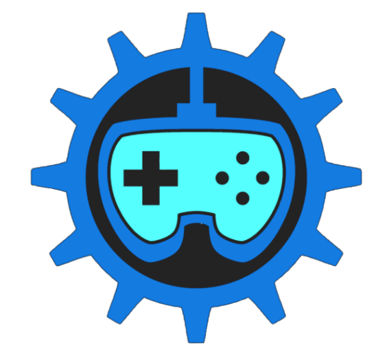

	<figure class="full">
	  
	</figure>

 

	<h2>Game Dev's meeting time</h2>
	<h4>Thursday 7:00-8:00 PM</h4>

## What is GameDev?

We are a passionate group dedicated to designing, building, and showcasing video games using Unity and various other tools.

## What can you learn?

- Designing : Stories, Characters, Levels and Game Mechanics
- Programing & Game Engines: Coding with Unity/Unreal and create/control mechanics and interfaces
- Art: Pixel Art + Animation, 3D Modeling in Maya, and Coverart

## How to join?

Our meetings are currently hosted in our discord server that you can join via [this link](https://discord.gg/5apDUyUEq4)! You can also check out our official website [here.](https://uhmgamedev.wixsite.com/my-site)



	<h2>Officers</h2>




 
