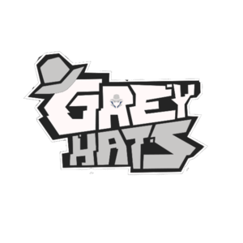

	<figure class="full">
	  
	</figure>

 

	<h2>Grey Hats meeting time</h2>
	<h4>Tuesdays 4:30-5:30 PM</h4>

The Grey Hats are a group focused towards cybersecurity at the University of Hawaii at Manoa.

### Who are the Grey Hats?

The Grey Hats is a student-led, extracurricular organization focused on real-world training for cyber defense. Membership gives students an outstanding opportunity to learn and apply critical skills, attack and defend systems, and to network with others interested in modern security issues.

## Everyone is Welcome

All individuals, regardless of skill level, are welcome to join.

## What do we do?

Our primary activities include participating in Capture the Flag (CTF) competitions and cybersecurity-focused contests. We actively compete in the National Cyber League (NCL) and the National Collegiate Cyber Defense Competition (CCDC).

## How to Join

Our meetings take place in the ICSpace (POST 318B) and are also accessible via Zoom on Tuesdays from 4:30 pm to 5:30 pm. Join the Grey Hats Discord server through [this link](https://discord.gg/r9xm9ZCVU3) for more details.



	<h2>Officers</h2>




