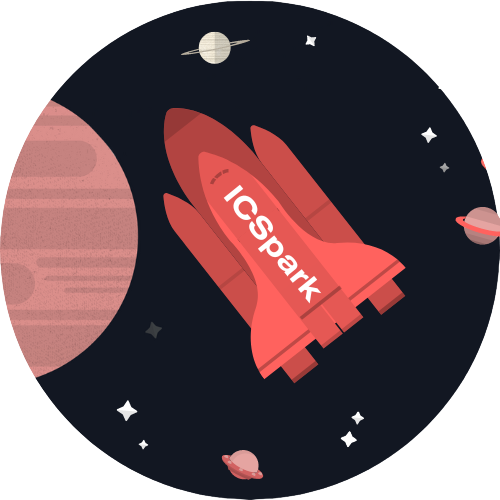

	<figure class="full">
	  
	</figure>

 

## What is ICSpark?

ICSpark is a Registered Independent Organization (RIO) at the University of Hawaii. We are a group of students who offer free coding classes every Saturday for students from the 6th to 12th grade.

## Everyone is Welcome

Our group is open to everyone!

## How to Join

For more information about ICSpark, please visit our [website](https://icspark.github.io/index.html).



	<h2>Officers</h2>



