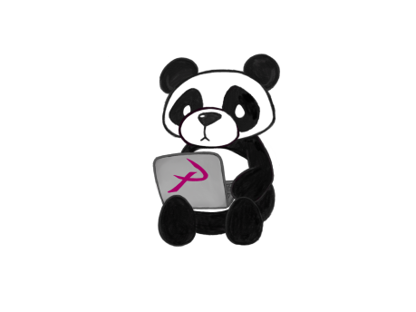

	<figure class="full">
	  
	</figure>

 

	<h2>Meeting Times</h2>
	<h4>Thursday 4:30-6:00 PM</h4>

 

## What is PANDA?

PANDA (Programming AND Algorithms) is a special interest group of ACM Mānoa dedicated to studying and applying algorithms. We aim to help students develop the algorithmic problem-solving skills needed to succeed in the field of computer science.

We hold weekly meetings that involves our mentors (Big Pandas) guiding students at various levels of programming experience to solve algorithmic problems similar to ones given in technical interviews. Additionally, we hold presentations aimed to educate students about career-related topics such as resumes, internships, and more!

## What do we do?

We hold weekly meetings dedicated to solving algorithm problems similar to those that are used in technical job interviews. We also host events aimed to educate students about computer science resumes, internships, and careers.

## Who is welcome?

The group is open to everyone!

## How to join?

Our meetings are currently hosted in person in the ICSpace located in POST 318B. Join the PANDA discord via [this link](https://discord.gg/naDnBZ5) and tag along with us in the ICSpace to attend our meetings!

Also, if you don't have a discord account, you are welcome to email us at *uhmpanda@gmail.com*.



	<h2>Officers</h2>




