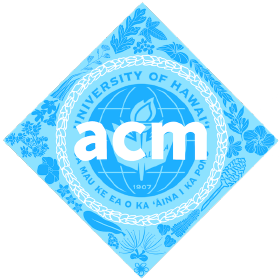

	<figure class="full">
	  
	</figure>

	<h2>Meeting Times</h2>
	<h4>Thursday 5:00-7:00 PM</h4>

 

## What do we do?

We design functional applications and websites for ACM through collaborative group work using React (a popular Javascript Library). This club aims to familiarize students with using Integrated Development Environments (IDEs) such as IntelliJ IDEA and VSCode. 

## Why

Joining a software development team offers a valuable chance to enhance skills, build connections, and gain practical experience. It provides opportunities to collaborate on projects, refine problem-solving abilities, and adhere to deadlines, fostering discipline and professionalism. Additionally, involvement in such a team not only enriches one's resume but also enables the sharing of knowledge, contributing to personal and collective growth within the field.

## Officers



