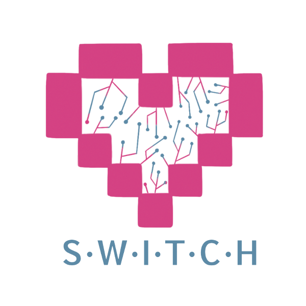

	<figure class="full">
	  
	</figure>

 

## What is SWITCH?

SWITCH (Supporting Women in Technology Computing Hawaii) is a dynamic community of students, faculty, and professionals committed to driving social change within the ICS department.

Established in Fall 2019, we proudly hold the titles of a UH Manoa RIO, ACM-W Chapter, and Girls Who Code College Loops Chapter. Our mission is to provide valuable resources from these organizations to enhance your professional, technical, and personal development.

For more infomation check out our [webpage:](https://switch-uhm.github.io/) [https://switch-uhm.github.io/](https://switch-uhm.github.io/)

## What do we do?

At SWITCH, we offer a supportive environment where you can:

- Foster Professional & Personal Growth
- Learn from Industry Professionals
- Explore Various CS Industries
- Discover Opportunities in Tech for Women

## Everyone Is Welcome

Our group is inclusive and welcomes members of all majors and genders.
Join us on [Discord](https://discord.gg/ksxdKeZBxP) to get involved!



	<h2>Officers</h2>




